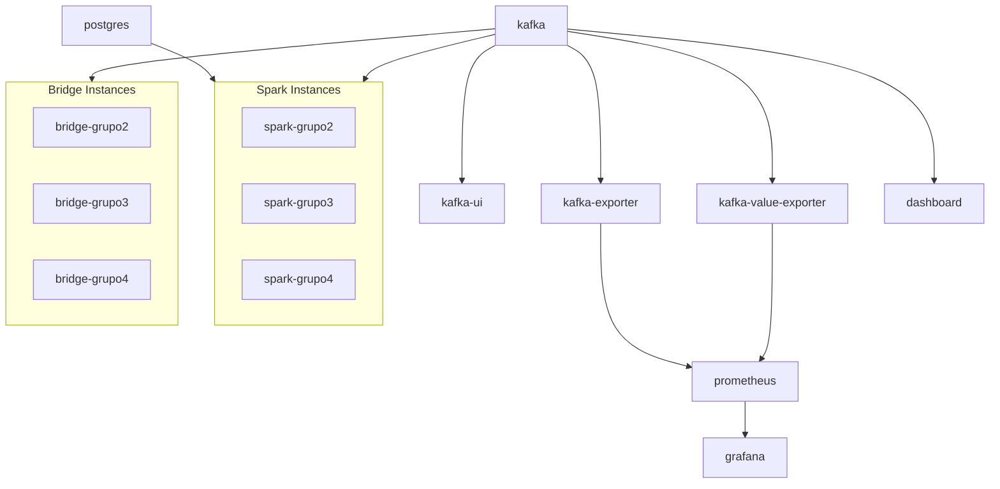

# Puertos y Servicios

## Mapa de Puertos

| Servicio | Contenedor | Puerto Interno | Puerto Externo | URL |
|---|---|---|---|---|
| **Dashboard** | `clime-dashboard` | 8501 | 8501 | [http://localhost:8501](http://localhost:8501) |
| **Jupyter Lab** | `clime-jupyter` | 8888 | 8888 | [http://localhost:8888](http://localhost:8888) |
| **Spark UI** | `clime-jupyter` | 4040 | 4040 | [http://localhost:4040](http://localhost:4040) |
| **Kafka Broker** | `clime-kafka` | 9092 / 19092 | 19092 | `localhost:19092` |
| **Kafka UI** | `clime-kafka-ui` | 8080 | 18085 | [http://localhost:18085](http://localhost:18085) |
| **Kafka Exporter** | `clime-kafka-exporter` | 9308 | 19308 | [http://localhost:19308/metrics](http://localhost:19308/metrics) |
| **Kafka Value Exporter** | `clime-kafka-value-exporter` | 8000 | 8000 | [http://localhost:8000/metrics](http://localhost:8000/metrics) |
| **Prometheus** | `clime-prometheus` | 9090 | 19090 | [http://localhost:19090](http://localhost:19090) |
| **Grafana** | `clime-grafana` | 3000 | 13000 | [http://localhost:13000](http://localhost:13000) |
| **PostgreSQL** | `clime-postgres` | 5432 | 15432 | `localhost:15432` |

### Servicios sin Puerto Expuesto

| Servicio | Contenedor | Propósito |
|---|---|---|
| Bridge grupo_2 | `clime-bridge-grupo2` | Puente Supabase → Kafka |
| Bridge grupo_3 | `clime-bridge-grupo3` | Puente Supabase → Kafka |
| Bridge grupo_4 | `clime-bridge-grupo4` | Puente Supabase → Kafka |
| Spark grupo_2 | `clime-spark-grupo2` | Streaming processor |
| Spark grupo_3 | `clime-spark-grupo3` | Streaming processor |
| Spark grupo_4 | `clime-spark-grupo4` | Streaming processor |

## Credenciales

| Servicio | Usuario | Contraseña | Base de Datos |
|---|---|---|---|
| PostgreSQL | `clime` | `clime123` | `climedb` |
| Grafana | `admin` | `admin` | — |
| Jupyter | — | `sintoken` (token) | — |

## Dependencias entre Servicios



## Variables de Entorno

| Variable | Servicios | Valor por Defecto |
|---|---|---|
| `KAFKA_BOOTSTRAP_SERVERS` | dashboard, bridges | `kafka:9092` |
| `POSTGRES_URL` | sparks | `jdbc:postgresql://postgres:5432/climedb` |
| `POSTGRES_USER` | sparks | `clime` |
| `POSTGRES_PASSWORD` | sparks | `clime123` |
| `SPARK_DRIVER_MEMORY` | sparks | `2g` |
| `SUPABASE_URL` | bridges | (configurada en docker-compose) |
| `SUPABASE_API_KEY` | bridges | (configurada en docker-compose) |
| `JUPYTER_TOKEN` | jupyter | `sintoken` |

## Volúmenes Montados

| Volumen (Host → Contenedor) | Servicios | Propósito |
|---|---|---|
| `../artifacts:/app/artifacts` | jupyter, dashboard, bridges, sparks | Parquet, checkpoints, catálogo |
| `../data:/app/data` | jupyter, dashboard | Datos SENAMHI crudos |
| `../ml:/app/ml` | jupyter, dashboard | Modelos ML y scripts |
| `../dashboard:/app/dashboard` | dashboard | Código del dashboard (hot reload) |
| `grafana_data:/var/lib/grafana` | grafana | Persistencia de dashboards |
| `pg_data:/var/lib/postgresql/data` | postgres | Persistencia de base de datos |

## Red Docker

```yaml
networks:
  clime-net:
    driver: bridge
```

Todos los servicios comparten la red `clime-net`. Kafka tiene alias `kafka` para resolución interna por nombre.
