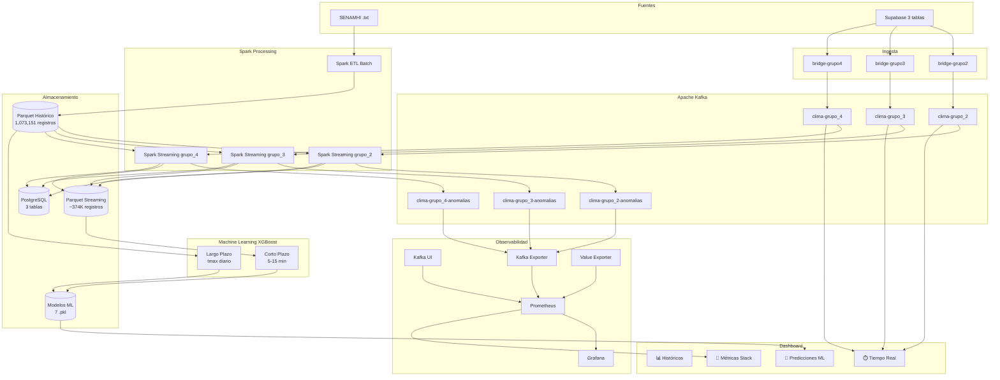

# CliMePerú — Sistema de Monitoreo Climático Inteligente

**CliMePerú** (Clima + Monitoreo + Perú) es un sistema Big Data híbrido que integra datos climáticos históricos del SENAMHI con lecturas en tiempo real de sensores IoT, utilizando **Apache Kafka** como backbone de mensajería, **Apache Spark Structured Streaming** para detección de anomalías, **XGBoost** para predicción de temperatura y **PostgreSQL** como almacenamiento persistente, con observabilidad completa del pipeline vía Prometheus y Grafana.

---

## Arquitectura General



## Stack Tecnológico

| Componente | Versión | Propósito |
|---|---|---|
| Apache Kafka | 4.2.0 | Broker de mensajería (KRaft, sin ZooKeeper) |
| Apache Spark | 4.1.2 (PySpark) | ETL batch y Structured Streaming |
| Prometheus | latest | Recolección de métricas |
| Grafana | latest | Dashboards de observabilidad |
| Kafka UI | latest | Gestión visual de tópicos |
| Streamlit | 1.58.0 | Dashboard interactivo |
| PostgreSQL | 15 | Almacenamiento persistente |
| XGBoost | latest | Modelos de regresión para predicción |
| Supabase | SaaS | Base de datos + Realtime WebSocket |
| Parquet | Snappy | Formato columnar comprimido |

## Estructura del Proyecto

```
clime-peru/
├── batch/                # ETL batch SENAMHI → Parquet
├── streaming/            # Bridges Supabase→Kafka + Spark Streaming
├── dashboard/            # Dashboard Streamlit (3 pestañas + ML)
├── ml/                   # Machine Learning (features, train, predict)
├── config/               # Configuración centralizada (YAML + dataclasses)
├── docker/               # Docker Compose + Dockerfiles + Prometheus/Grafana
├── data/                 # Datos SENAMHI crudos (.txt)
├── artifacts/            # Parquet, checkpoints, modelos
├── docs/                 # Documentación (MkDocs)
├── scripts/              # Scripts auxiliares
└── tests/                # Tests unitarios
```

## Enlaces Rápidos

- **Dashboard**: [http://localhost:8501](http://localhost:8501)
- **Kafka UI**: [http://localhost:18085](http://localhost:18085)
- **Prometheus**: [http://localhost:19090](http://localhost:19090)
- **Grafana**: [http://localhost:13000](http://localhost:13000) (admin/admin)
- **PostgreSQL**: `localhost:15432` (clime/climedb)
- **Repositorio**: [https://github.com/anomalyco/clime-peru](https://github.com/anomalyco/clime-peru)
