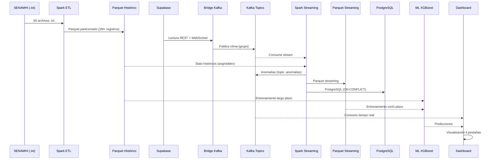

# 1. Introducción y Arquitectura

## 1.1 Descripción General

CliMePerú es un sistema Big Data para el monitoreo climático en la región de Puno, Perú. Integra datos meteorológicos históricos del Servicio Nacional de Meteorología e Hidrología del Perú (SENAMHI) con lecturas en tiempo real de sensores IoT desplegados en estaciones meteorológicas.

El sistema abarca desde la ingesta y procesamiento de datos hasta la visualización, detección de anomalías y predicción mediante modelos de Machine Learning.

### Propósitos Clave

- **Monitorear** variables climáticas (temperatura, humedad, presión, calidad del aire) en tiempo real.
- **Detectar** anomalías climáticas mediante análisis estadístico con Spark Structured Streaming.
- **Predecir** temperaturas usando modelos XGBoost entrenados con datos históricos y streaming.
- **Observar** la salud del pipeline completo con métricas Prometheus y dashboards Grafana.

## 1.2 Arquitectura del Sistema

El sistema sigue una **arquitectura Kappa**: un pipeline de streaming unificado procesa tanto datos históricos (reprocesados) como datos en tiempo real, evitando la complejidad de mantener pipelines Lambda separados.

### Capas de la Arquitectura

| Capa | Componente | Tecnología | Función |
|---|---|---|---|
| **Fuentes** | SENAMHI | Archivos .txt | 60 estaciones históricas (1940-2015) |
| | Supabase | PostgreSQL + WebSocket | 3 tablas de sensores IoT |
| **Ingesta** | Bridges | Kafka Producer | 3 bridges independientes |
| **Mensajería** | Kafka Broker | Apache Kafka 4.2.0 (KRaft) | 6 tópicos (3 datos + 3 anomalías) |
| **Procesamiento Batch** | Spark ETL | PySpark 4.1.2 | .txt → Parquet particionado |
| **Procesamiento Streaming** | Spark Structured Streaming | PySpark + Kafka connector | Parseo, anomalías, 3 sinks |
| **Machine Learning** | XGBoost | Python + joblib | Predicción largo y corto plazo |
| **Almacenamiento** | Parquet | Snappy compression | Datos históricos y streaming |
| | PostgreSQL 15 | psycopg2 + JDBC | Datos streaming con dedup |
| **Observabilidad** | Prometheus + Grafana | Exporters + Dashboards | Métricas, alertas, logs |
| **Visualización** | Streamlit + Plotly | Dashboard interactivo | 4 pestañas: histórico, real, ML, stack |

### Diagrama de Flujo de Datos

## 1.3 Decisiones Arquitectónicas

### Kappa sobre Lambda

Se eligió arquitectura Kappa porque:

- Los datos históricos SENAMHI se reprocesan a través del mismo pipeline Spark que los datos streaming.
- El ETL batch inicial es una carga única; las actualizaciones incrementales fluyen por Kafka.
- Simplifica el mantenimiento al tener un solo código base de procesamiento.

### KRaft sobre ZooKeeper

Kafka 4.2.0 usa KRaft (Raft-based metadata) eliminando la dependencia de ZooKeeper:

- Un solo proceso para metadata y datos.
- Arranque más rápido y menos recursos.
- Configuración más simple.

### Bridges Independientes

Cada tabla de Supabase tiene su propio bridge:

- Aislamiento: si un bridge falla, los demás continúan.
- Checkpoint recovery independiente por tabla.
- Escalado horizontal: se pueden agregar más bridges para más tablas.

## 1.4 Estaciones Monitoreadas

| Grupo | Tabla Supabase | Departamento | Provincia | Distrito | Estado |
|---|---|---|---|---|---|
| grupo_2 | `grupo_2_air_quality` | PUNO | LAMPA | LAMPA | Activo |
| grupo_3 | `grupo_3_air_quality` | PUNO | PUNO | PUNO | Activo (sensor con datos anómalos) |
| grupo_4 | `grupo4_air_quality` | PUNO | AZANGARO | AZANGARO | Activo |

### Nota sobre grupo_3

El sensor del grupo_3 presenta lecturas anómalas:
- Presión atmosférica de ~186 hPa (vs ~646 hPa en los otros grupos)
- Temperatura constante de aproximadamente -0.06°C
- Esto impide entrenar un modelo de Machine Learning confiable para corto plazo en esta estación

Los modelos de largo plazo no se ven afectados porque usan datos independientes del SENAMHI.
