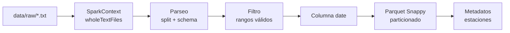

# 2. ETL Batch con Spark

## 2.1 Descripción

El proceso ETL batch convierte archivos climáticos históricos del SENAMHI (formato `.txt`) a Parquet optimizado para consultas analíticas. Este dataset es la base para:

- Cálculo de estadísticos históricos (promedio y desviación estándar de temperatura) usados por Spark Streaming para detectar anomalías.
- Entrenamiento de modelos de Machine Learning de largo plazo (predicción de tmax diaria).
- Visualización de datos históricos en el dashboard.

## 2.2 Fuente de Datos

### Archivos SENAMHI

60 archivos nombrados con el patrón `ESTACION-DEPARTAMENTO-PROVINCIA-DISTRITO.txt`.

```
PAMPAS-AMAZONAS-CHACHAPOYAS-PAMPAS.txt
PUNO-PUNO-PUNO-PUNO.txt
LAMPA-PUNO-LAMPA-LAMPA.txt
...
```

Cada línea contiene 6 columnas separadas por espacio:

| Columna | Tipo | Ejemplo | Descripción |
|---|---|---|---|
| Año | int | 1965 | 1900-2030 |
| Mes | int | 01 | 1-12 |
| Día | int | 02 | 1-31 |
| Precipitación | float | 0.0 | mm, -99.9 = nulo |
| Tmax | float | 15.2 | °C, -99.9 = nulo |
| Tmin | float | 4.6 | °C, -99.9 = nulo |

### Cobertura

- **60 estaciones** únicas
- **11 departamentos**: AMAMZONAS, AMAZONAS, ANCASH, APURIMAC, AREQUIPA, CUSCO, HUANCAVELICA, HUANUCO, ICA, JUNIN, PUNO
- **Período**: 1940-01-01 a 2015-10-31
- **1,073,151 registros**
- **~14 MB** en Parquet comprimido Snappy (2989 archivos)

## 2.3 Pipeline ETL

### Componentes

| Archivo | Tecnología | Propósito |
|---|---|---|
| `batch/etl_senamhi.py` | PySpark | Pipeline completo (recomendado) |
| `batch/etl_pandas.py` | Pandas | Alternativa sin Spark |

### Flujo de Procesamiento



### Etapas

#### Extract

```python
raw_rdd = spark.sparkContext.wholeTextFiles("data/raw/*.txt")
```

Lee todos los archivos `.txt` como pares `(nombre_archivo, contenido_completo)`. Cada archivo se procesa como una unidad, extrayendo el nombre de la estación del nombre del archivo.

#### Transform

1. **Parseo**: Cada línea del contenido se divide en 6 columnas: `year, month, day, precip, tmax, tmin`.
2. **Limpieza**: Se filtran registros con:
   - Mes fuera del rango 1-12
   - Día fuera del rango 1-31
   - Año fuera del rango 1900-2030
3. **Tipado**: Conversión a tipos numéricos (`int` para fecha, `float` para variables climáticas).
4. **Fecha**: Creación de columna `date` con `to_date(concat_ws("-", year, month, day))`.
5. **Particionamiento**: Se asignan columnas `department`, `province`, `district` desde el nombre del archivo.

#### Load

```python
df.write.mode("overwrite") \
    .partitionBy("department", "province", "district", "year") \
    .option("compression", "snappy") \
    .parquet("artifacts/weather_data")
```

### Particionamiento

```
artifacts/weather_data/
├── department=PUNO/
│   └── province=PUNO/
│       └── district=PUNO/
│           ├── year=1964/
│           │   ├── part-00001-xxx.snappy.parquet
│           │   └── part-00002-xxx.snappy.parquet
│           ├── year=1965/
│           └── ...
├── department=ICA/
│   └── ...
└── _SUCCESS
```

## 2.4 Métricas del Dataset

### Por Departamento

| Departamento | Estaciones | Registros |
|---|---|---|
| PUNO | 6 | 125,000+ |
| CUSCO | 8 | 140,000+ |
| AREQUIPA | 5 | 90,000+ |
| ... | 41 más | ~718,000 |
| **Total** | **60** | **1,073,151** |

### Estadísticos Globales

| Variable | Promedio | Desviación Estándar | Mínimo | Máximo |
|---|---|---|---|---|
| Tmax (°C) | 21.12 | 6.01 | -5.0 | 40.0 |
| Tmin (°C) | 8.45 | 5.23 | -15.0 | 30.0 |
| Precipitación (mm) | 2.18 | 8.45 | 0.0 | 150.0 |

## 2.5 Ejecución

```bash
# Con Docker (recomendado)
docker exec clime-jupyter python -m batch.etl_senamhi

# Local (sin Spark)
python -m batch.etl_pandas
```

## 2.6 Uso del Dataset

### Spark Streaming

El Spark Streaming Processor (`streaming/spark_streaming_processor.py`) usa este Parquet para calcular `avg(tmax)` y `stddev(tmax)` históricos por ubicación geográfica. Nota: usa `tmax` (temperatura máxima) como proxy de `temperatura` porque los datos streaming contienen temperatura instantánea.

### Machine Learning

`ml/train_largo_plazo.py` consume este Parquet para entrenar modelos XGBoost de predicción de tmax diaria, filtrando las estaciones con más de 1000 registros (PUNO, AZANGARO, LAMPA, CAPACHICA).

### Dashboard

`dashboard/app.py` lee `artifacts/weather_data/` y `artifacts/stations_metadata.parquet` para la pestaña de visualización histórica.

## 2.7 Validación de Calidad

| Regla | Acción |
|---|---|
| Mes inválido (< 1 o > 12) | Descartar registro |
| Día inválido (< 1 o > 31) | Descartar registro |
| Año fuera de rango | Descartar registro |
| Temperatura fuera de rango físico | Descartar registro |
| Valores nulos (-99.9, NA) | Conservar registro, columna nula |
