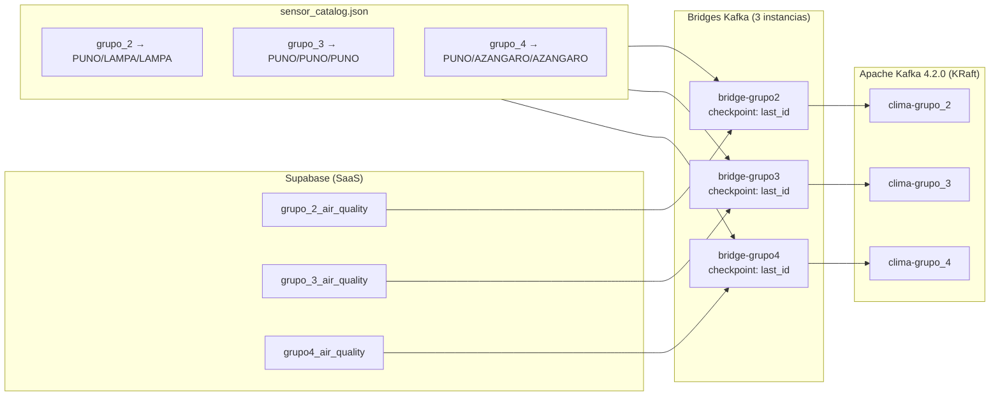

# 5. Ingesta en Tiempo Real (Kafka)

## 5.1 Descripción General

Apache Kafka actúa como el backbone de mensajería del sistema. Tres bridges independientes leen datos desde Supabase (1 tabla por sensor) y los publican a tópicos Kafka dedicados. Spark Streaming consume estos tópicos para procesamiento y detección de anomalías.

## 5.2 Arquitectura de Ingesta



## 5.3 Bridges Supabase → Kafka

### Componente

`streaming/supabase_kafka_bridge.py`

### Parámetros de Ejecución

```bash
bridge-grupo2: --table grupo_2_air_quality --topic clima-grupo_2 --time-format string
bridge-grupo3: --table grupo_3_air_quality --topic clima-grupo_3 --time-format string
bridge-grupo4: --table grupo4_air_quality  --topic clima-grupo_4 --time-format string
```

### Mecanismos de Ingesta

| Mecanismo | Descripción | Frecuencia |
|---|---|---|
| **Carga Inicial** | REST API con paginación de 1000 registros, desde `id > checkpoint` | Una vez al iniciar |
| **WebSocket Realtime** | `postgres_changes` escucha INSERT en la tabla configurada | Streaming continuo |
| **Polling Respaldo** | Consulta `id > last_id` como fallback | Cada 30 segundos |

### Checkpoint Recovery

Cada bridge mantiene un archivo de checkpoint persistente:

```
/artifacts/bridge_checkpoints/grupo_2_air_quality.json
/artifacts/bridge_checkpoints/grupo_3_air_quality.json
/artifacts/bridge_checkpoints/grupo4_air_quality.json
```

Contenido:
```json
{"last_id": 132255}
```

Al reiniciar el bridge:
1. Verifica si existe el archivo de checkpoint.
2. Si existe, carga solo registros con `id > last_id`.
3. Si no existe, carga todos los registros históricos.
4. Actualiza el checkpoint después de cada lote publicado.

### Inyección de Ubicación

Cada mensaje se enriquece con datos geográficos del catálogo:

```json
{
  "sensor_id": "grupo_2",
  "estacion": "grupo_2",
  "department": "PUNO",
  "province": "LAMPA",
  "district": "LAMPA",
  ...
}
```

### Normalización de Timestamps

```python
# Antes
"created_at": "2026-05-25T12:00:00"
# Después (con offset -05:00)
"created_at": "2026-05-25T12:00:00-05:00"
```

## 5.4 Tópicos Kafka

Cada estación tiene un par de tópicos:

| Tópico | Propósito | Creado por |
|---|---|---|
| `clima-grupo_2` | Datos crudos del sensor | Bridge grupo_2 |
| `clima-grupo_2-anomalias` | Anomalías detectadas | Spark grupo_2 |
| `clima-grupo_3` | Datos crudos del sensor | Bridge grupo_3 |
| `clima-grupo_3-anomalias` | Anomalías detectadas | Spark grupo_3 |
| `clima-grupo_4` | Datos crudos del sensor | Bridge grupo_4 |
| `clima-grupo_4-anomalias` | Anomalías detectadas | Spark grupo_4 |

Los tópicos de anomalías se crean automáticamente gracias a `auto.create.topics.enable=true` cuando Spark escribe el primer microbatch.

## 5.5 Configuración de Kafka

### Kafka Broker (KRaft)

```yaml
# docker-compose.yml
services:
  kafka:
    image: apache/kafka:4.2.0
    environment:
      KAFKA_NODE_ID: 1
      KAFKA_PROCESS_ROLES: "broker,controller"
      KAFKA_LISTENERS: "PLAINTEXT://0.0.0.0:9092,CONTROLLER://0.0.0.0:9093,EXTERNAL://0.0.0.0:19092"
      KAFKA_ADVERTISED_LISTENERS: "PLAINTEXT://kafka:9092,EXTERNAL://localhost:19092"
      KAFKA_CONTROLLER_QUORUM_VOTERS: "1@kafka:9093"
      KAFKA_AUTO_CREATE_TOPICS_ENABLE: "true"
```

### Consumidores

- **Dashboard**: Consumer group `dashboard-consumer` con retry backoff exponencial hasta 15 intentos.
- **Spark**: `startingOffsets=earliest` para procesar datos desde el inicio del tópico.

### Retry Backoff en Dashboard

```python
def init_kafka_consumer():
    max_retries = 15
    base_delay = 1
    for attempt in range(max_retries):
        try:
            return KafkaConsumer(
                bootstrap_servers=bootstrap_servers,
                group_id="dashboard-consumer",
                request_timeout_ms=5000,
                ...
            )
        except Exception:
            delay = min(base_delay * 2 ** attempt, 30)
            time.sleep(delay)
    raise RuntimeError("No se pudo conectar a Kafka")
```

## 5.6 Herramientas de Gestión

### Kafka UI

Acceso web: [http://localhost:18085](http://localhost:18085)

### Comandos CLI

```bash
# Listar tópicos
docker exec clime-kafka /opt/kafka/bin/kafka-topics.sh \
  --bootstrap-server localhost:9092 --list

# Ver offsets
docker exec clime-kafka /opt/kafka/bin/kafka-run-class.sh kafka.tools.GetOffsetShell \
  --bootstrap-server localhost:9092 --topic clima-grupo_2

# Consumir mensajes
docker exec clime-kafka /opt/kafka/bin/kafka-console-consumer.sh \
  --bootstrap-server localhost:9092 --topic clima-grupo_2 \
  --from-beginning --max-messages 5
```

## 5.7 Verificación de Funcionamiento

```bash
# Verificar bridges activos
docker ps | grep bridge

# Ver logs de un bridge
docker logs clime-bridge-grupo2

# Verificar offset en Kafka UI
curl http://localhost:18085/api/clusters/local/topics
```
