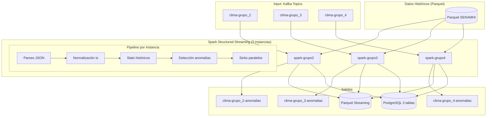
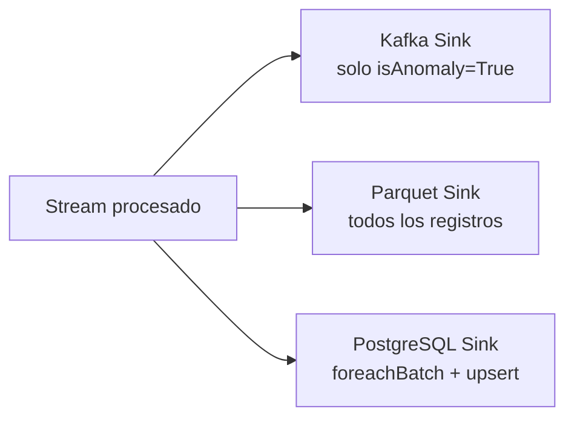

# 6. Procesamiento Streaming con Spark

## 6.1 Descripción General

Spark Structured Streaming procesa en tiempo real los datos de sensores provenientes de Kafka, detecta anomalías basadas en desviación estadística y escribe los resultados a 3 sinks diferentes: Kafka (anomalías), Parquet (streaming) y PostgreSQL (persistente).

## 6.2 Arquitectura de Streaming



## 6.3 Pipeline de Transformación

Cada instancia de Spark ejecuta el siguiente pipeline:

### Etapa 1: Parseo JSON

```python
raw_df = spark.readStream \
    .format("kafka") \
    .option("kafka.bootstrap.servers", "kafka:9092") \
    .option("subscribe", input_topic) \
    .option("startingOffsets", "earliest") \
    .load()

parsed_df = raw_df.select(
    from_json(col("value").cast("string"), sensor_schema).alias("data")
).select("data.*")
```

### Etapa 2: Normalización de Timestamps

```python
from pyspark.sql.functions import regexp_replace

normalized_df = parsed_df.withColumn(
    "ts",
    regexp_replace(
        regexp_replace(col("ts"), r"[+-]\d{2}:\d{2}$", ""),
        r"\.\d+", ""
    )
)
```

### Etapa 3: Cálculo de Stats Históricos

Spark carga el Parquet histórico y filtra por la ubicación exacta del sensor según `sensor_catalog.json`:

```python
historical_df = spark.read.parquet("artifacts/weather_data")
stats_df = historical_df.filter(
    (col("department") == catalog["department"]) &
    (col("province") == catalog["province"]) &
    (col("district") == catalog["district"])
).agg(
    avg("tmax").alias("promedioHistorico"),
    stddev("tmax").alias("desviacionEstandar")
).collect()[0]
```

### Etapa 4: Detección de Anomalías

```python
from pyspark.sql.functions import abs as spark_abs, when

anomaly_df = normalized_df.withColumn(
    "anomalyScore",
    spark_abs((col("temperatura") - lit(promedio)) / lit(stddev))
).withColumn(
    "isAnomaly",
    col("anomalyScore") > lit(sigma)
).withColumn(
    "anomalyType",
    when(col("anomalyScore") > lit(sigma),
         when(col("temperatura") > lit(promedio), "alta").otherwise("baja")
    ).otherwise("normal")
)
```

### Etapa 5: Sinks Paralelos



#### Kafka Sink (solo anomalías)

```python
def write_to_kafka(batch_df, batch_id):
    anomalies = batch_df.filter(col("isAnomaly") == True)
    if anomalies.count() > 0:
        anomalies.selectExpr("to_json(struct(*)) AS value") \
            .write \
            .format("kafka") \
            .option("kafka.bootstrap.servers", "kafka:9092") \
            .option("topic", anomaly_topic) \
            .save()
```

#### Parquet Sink

```python
query_parquet = anomaly_df.writeStream \
    .format("parquet") \
    .option("path", f"artifacts/parquet_output/{estacion}/") \
    .option("checkpointLocation", f"artifacts/checkpoints/parquet/{estacion}") \
    .trigger(processingTime="5 seconds") \
    .start()
```

#### PostgreSQL Sink

```python
def write_to_postgres(batch_df, batch_id):
    selected_columns = ["id", "sensor_id", "estacion", "department",
                        "province", "district", "temperatura", "humedad",
                        "presion", "altura", "iaq", "eco2", "voc",
                        "calidad_aire", "ts", "created_at", "processed_at"]
    
    batch_df.select(selected_columns) \
        .write \
        .mode("append") \
        .format("jdbc") \
        .option("url", jdbc_url) \
        .option("dbtable", f"sensor_data_{estacion}") \
        .option("user", db_user) \
        .option("password", db_password) \
        .option("driver", "org.postgresql.Driver") \
        .save()

query_pg = anomaly_df.writeStream \
    .foreachBatch(write_to_postgres) \
    .trigger(processingTime="5 seconds") \
    .start()
```

## 6.4 Parámetros de Procesamiento

| Parámetro | Valor | Descripción |
|---|---|---|
| Trigger | 5 segundos | Micro-batch cada 5s |
| Watermark | 30 segundos | Tolerancia a datos tardíos |
| Ventana | 1 minuto | Tumbling window para métricas |
| Output mode | append | Solo nuevas filas |
| Sigma anomalía | 2.0 | Desviaciones estándar para considerar anomalía |
| Starting offsets | earliest | Procesa desde el inicio del tópico |

## 6.5 Datos por Grupo

| Grupo | Estación | Registros en Parquet | Tabla PostgreSQL | Estado del Sensor |
|---|---|---|---|---|
| grupo_2 | PUNO/LAMPA/LAMPA | ~136,000 | `sensor_data_grupo_2` | Normal |
| grupo_3 | PUNO/PUNO/PUNO | ~141,000 | `sensor_data_grupo_3` | Presión anómala (186 hPa) |
| grupo_4 | PUNO/AZANGARO/AZANGARO | ~97,000 | `sensor_data_grupo_4` | Normal |

## 6.6 Monitoreo de Streaming

```bash
# Ver logs de Spark Streaming
docker logs clime-spark-grupo2

# Verificar datos en PostgreSQL
docker exec clime-postgres psql -U clime -d climedb \
  -c "SELECT COUNT(*) FROM sensor_data_grupo_2"

# Ver offsets en Kafka
docker exec clime-kafka /opt/kafka/bin/kafka-run-class.sh kafka.tools.GetOffsetShell \
  --bootstrap-server localhost:9092 --topic clima-grupo_2
```

## 6.7 Checkpoint Recovery

Spark Structured Streaming mantiene checkpoints para cada instancia:

```
artifacts/checkpoints/
├── kafka/grupo_2/
├── kafka/grupo_3/
├── kafka/grupo_4/
├── parquet/grupo_2/
├── parquet/grupo_3/
└── parquet/grupo_4/
```

### Comportamiento

- **Si existe checkpoint**: Spark reanuda desde la última posición confirmada (exactly-once).
- **Si no existe checkpoint**: Spark procesa desde `startingOffsets` configurado (`earliest`).
- **Para reiniciar desde cero**: Eliminar los directorios de checkpoint y topics Kafka.

## 6.8 Configuración

```yaml
# config/config.yaml
streaming:
  trigger_interval: "5 seconds"
  watermark: "30 seconds"
  window_duration: "1 minute"
  checkpoint_location: "/app/artifacts/checkpoints"

sensor:
  anomaly_threshold_sigma: 2.0
```

```yaml
# docker-compose.yml (argumentos por servicio)
spark-grupo2:
  command: >
    python -m streaming.spark_streaming_processor
    --input-topic clima-grupo_2
    --anomaly-topic clima-grupo_2-anomalias
```
