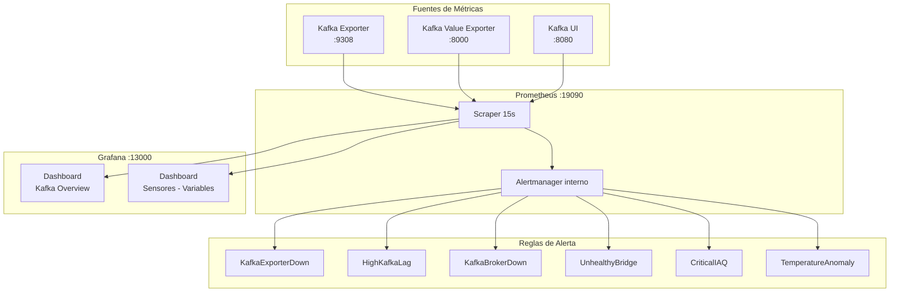

# 7. Observabilidad y Costos

## 7.1 Stack de Observabilidad

CliMePerú implementa observabilidad completa del pipeline utilizando Prometheus para recolección de métricas y Grafana para visualización.



## 7.2 Exporters

### Kafka Exporter

Exporta métricas estándar de Kafka a Prometheus:

| Métrica PromQL | Descripción |
|---|---|
| `kafka_brokers` | Número de brokers activos |
| `kafka_topic_partition_current_offset{topic="clima-grupo_2"}` | Offset actual por tópico |
| `kafka_consumergroup_lag` | Lag por consumer group |
| `kafka_topic_partition_under_replicated_partitions` | Particiones sub-replicadas |

### Kafka Value Exporter

Exporter personalizado que expone variables reales de sensores como métricas Prometheus gauge:

| Métrica | Labels | Descripción |
|---|---|---|
| `sensor_temperatura_celsius` | `topic, department, province, district` | Temperatura en °C |
| `sensor_humedad_porcentaje` | `topic, department, province, district` | Humedad relativa % |
| `sensor_presion_hpa` | `topic, department, province, district` | Presión atmosférica hPa |
| `sensor_iaq` | `topic, department, province, district` | Índice de calidad del aire |
| `sensor_eco2_ppm` | `topic, department, province, district` | CO₂ equivalente ppm |
| `sensor_voc_ppb` | `topic, department, province, district` | Compuestos orgánicos volátiles ppb |
| `sensor_anomalia_count` | `topic, type` | Conteo de anomalías por tipo |

## 7.3 Prometheus

### Configuración de Scraping

```yaml
# docker/prometheus/prometheus.yml
scrape_configs:
  - job_name: 'prometheus'
    scrape_interval: 15s
    static_configs:
      - targets: ['localhost:9090']

  - job_name: 'kafka-exporter'
    scrape_interval: 15s
    static_configs:
      - targets: ['kafka-exporter:9308']

  - job_name: 'kafka-value-exporter'
    scrape_interval: 10s
    static_configs:
      - targets: ['kafka-value-exporter:8000']

  - job_name: 'kafka-ui'
    scrape_interval: 15s
    static_configs:
      - targets: ['kafka-ui:8080']
```

### Reglas de Alerta

Se definen 10 reglas de alerta:

#### Infraestructura (4 reglas)

| Alerta | Expresión | For | Severidad |
|---|---|---|---|
| `KafkaExporterDown` | `up{job="kafka-exporter"} == 0` | 1m | critical |
| `HighKafkaLag` | `kafka_consumergroup_lag > 100` | 2m | warning |
| `UnderReplicatedPartitions` | `kafka_topic_partition_under_replicated_partitions > 0` | 1m | warning |
| `KafkaBrokerDown` | `kafka_brokers < 1` | 1m | critical |

#### Sensores (6 reglas)

| Alerta | Condición | Descripción |
|---|---|---|
| `BridgeDown_grupo_2` | `sensor_temperatura_celsius{topic="clima-grupo_2"} absent` | Bridge grupo_2 sin datos |
| `BridgeDown_grupo_3` | `sensor_temperatura_celsius{topic="clima-grupo_3"} absent` | Bridge grupo_3 sin datos |
| `BridgeDown_grupo_4` | `sensor_temperatura_celsius{topic="clima-grupo_4"} absent` | Bridge grupo_4 sin datos |
| `CriticalIAQ` | `sensor_iaq > 100` | IAQ crítico en alguna estación |
| `TemperatureAnomaly` | `sensor_anomalia_count{type="alta"} > 0` | Anomalía de temperatura detectada |
| `StaleSensorData` | `time() - sensor_temperatura_celsius > 300` | Datos desactualizados (>5 min) |

## 7.4 Dashboards Grafana

### Dashboard 1: Kafka Overview

Paneles para monitoreo de infraestructura Kafka:

- Brokers activos
- Offsets por tópico
- Lag de consumer groups
- Tasa de mensajes/s
- Estado del Kafka Exporter

### Dashboard 2: Sensores — Variables por Estación

Paneles específicos para datos climáticos:

- **Todas las variables**: Serie temporal con múltiples ejes Y
- **Temperatura**: Gauge + serie temporal + alertas
- **Humedad**: Serie temporal con promedio
- **Presión**: Evolución con línea de referencia
- **Calidad del Aire**: IAQ, eCO₂, VOC
- **Anomalías**: Conteo por tipo + anotaciones
- **Alertas activas**: Tabla de alertas vigentes
- **Estado de sensores**: Último mensaje recibido por estación

## 7.5 Dashboard Streamlit

### Pestañas

| Pestaña | Función | Fuente de Datos |
|---|---|---|
| 📊 **Datos Históricos** | Visualización de datos SENAMHI | Parquet histórico |
| ⏱️ **Tiempo Real** | Streaming en vivo de sensores | Kafka (dashboard-consumer) |
| 🤖 **Predicciones ML** | Predicción con XGBoost | Modelos .pkl |
| 📡 **Métricas del Stack** | Salud del pipeline Kafka | Prometheus API |

### Características del Dashboard

- **Auto-refresh**: Cada 2 segundos en pestaña Tiempo Real.
- **Consumer group**: `dashboard-consumer` con backoff exponencial.
- **Buffer streaming**: `StreamingBuffer(maxlen=100)` para cálculos de ventana.
- **Tema**: Soporte nativo dark/light via Streamlit + CSS `[data-theme]` injection.
- **Persistencia ML**: Resultados en `st.session_state` para mantener visibles tras auto-refresh.

## 7.6 Estimación de Costos

### Recursos Actuales (Local)

| Recurso | Cantidad | Especificación |
|---|---|---|
| Contenedores | 15 | Kafka, Spark (3+1), Bridges (3), Dashboard, UI, Exporter (2), PostgreSQL, Prometheus, Grafana |
| CPU | ~4-6 cores | Modo `local[*]` en cada Spark |
| RAM | ~8-12 GB | Spark 2g c/u, Kafka 2g, PostgreSQL 1g |
| Disco | ~5 GB | Parquet, modelos, checkpoints, logs |

### Costos Cloud Estimados (AWS)

| Servicio | Instancia | Costo Mensual Estimado |
|---|---|---|
| Kafka (MSK) | 1 broker `kafka.m5.large` | ~$150 |
| Spark (EMR) | 1 nodo `m5.xlarge` | ~$200 |
| PostgreSQL (RDS) | `db.t3.medium` | ~$80 |
| Dashboard (EC2) | `t3.small` | ~$25 |
| Prometheus/Grafana | Incluido en EC2 | — |
| **Total estimado** | | **~$455/mes** |

### Estrategia de Escalado

| Componente | Escalado Horizontal | Escalado Vertical |
|---|---|---|
| Kafka | 3 brokers, replicación factor 2 | `kafka.m5.xlarge` (64 GB) |
| Spark | 2+ workers Standalone/YARN | `m5.2xlarge` (32 GB RAM) |
| PostgreSQL | Read replicas | `db.t3.large` (16 GB RAM) |
| Dashboard | Múltiples instancias | `t3.medium` |

## 7.7 Puertos y Servicios

| Servicio | Puerto Interno | Puerto Externo | URL |
|---|---|---|---|
| Dashboard | 8501 | 8501 | `http://localhost:8501` |
| Kafka UI | 8080 | 18085 | `http://localhost:18085` |
| Prometheus | 9090 | 19090 | `http://localhost:19090` |
| Grafana | 3000 | 13000 | `http://localhost:13000` (admin/admin) |
| Kafka Exporter | 9308 | 19308 | `http://localhost:19308/metrics` |
| Kafka Value Exporter | 8000 | 8000 | `http://localhost:8000/metrics` |
| Kafka (externo) | 19092 | 19092 | `localhost:19092` |
| PostgreSQL | 5432 | 15432 | `localhost:15432` (clime/climedb) |
| Spark UI | 4040 | 4040 | `http://localhost:4040` |
