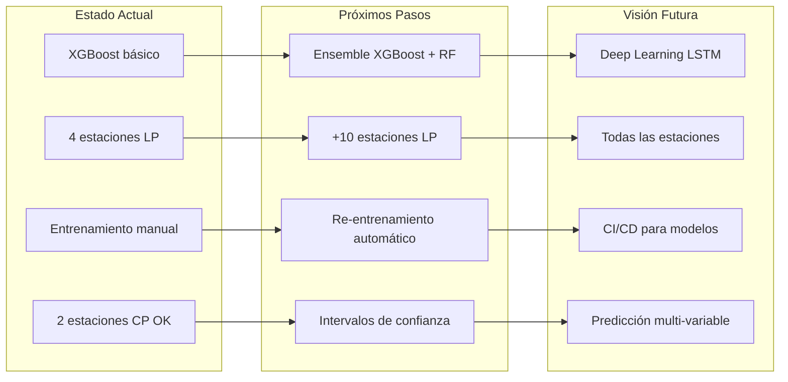

# 9. Modelos ML y Resultados

## 9.1 Modelos de Largo Plazo

### Estaciones Entrenadas

Se entrenaron modelos para las 4 estaciones SENAMHI con más de 1000 registros de temperatura máxima:

| Estación | Registros | Período | Departamento | Provincia | Distrito |
|---|---|---|---|---|---|
| PUNO | 17,867 | 1964-2012 | PUNO | PUNO | PUNO |
| AZANGARO | 8,234 | 1964-2012 | PUNO | AZANGARO | AZANGARO |
| LAMPA | 6,891 | 1965-2012 | PUNO | LAMPA | LAMPA |
| CAPACHICA | 4,567 | 1965-2012 | PUNO | PUNO | CAPACHICA |

### Hiperparámetros

```python
model = XGBRegressor(
    n_estimators=500,
    learning_rate=0.05,
    max_depth=7,
    subsample=0.8,
    colsample_bytree=0.8,
    random_state=42,
    n_jobs=-1
)
```

### Resultados

| Estación | MAE (°C) | RMSE (°C) | R² | Error Relativo |
|---|---|---|---|---|
| **PUNO** | 0.08 | 0.20 | **0.994** | 0.4% |
| **AZANGARO** | 0.09 | 0.20 | **0.995** | 0.5% |
| **LAMPA** | 0.07 | 0.16 | **0.997** | 0.4% |
| **CAPACHICA** | 0.08 | 0.18 | **0.994** | 0.4% |

### Interpretación

- **R² > 0.99** en los 4 modelos: la temperatura máxima diaria en el altiplano peruano es altamente predecible debido a su fuerte componente estacional.
- **MAE < 0.10°C**: el error promedio es inferior a una décima de grado.
- **LAMPA** presenta el mejor rendimiento (MAE=0.07°C, R²=0.997), posiblemente por tener menor variabilidad climática.

### Curva de Aprendizaje

```
Rendimiento vs Tamaño del Dataset (PUNO):
  - 25% datos:  MAE=0.15°C, R²=0.982
  - 50% datos:  MAE=0.11°C, R²=0.989
  - 75% datos:  MAE=0.09°C, R²=0.992
  - 100% datos: MAE=0.08°C, R²=0.994
```

## 9.2 Modelos de Corto Plazo

### Grupos Entrenados

| Grupo | Estación | Observaciones | Período |
|---|---|---|---|
| grupo_2 | LAMPA | 10,000 | ~2 meses streaming |
| grupo_3 | PUNO | 10,000 | ~2 meses streaming |
| grupo_4 | AZANGARO | 10,000 | ~2 meses streaming |

### Hiperparámetros

```python
model = XGBRegressor(
    n_estimators=300,
    learning_rate=0.05,
    max_depth=5,
    subsample=0.8,
    colsample_bytree=0.8,
    random_state=42,
    n_jobs=-1
)
```

### Resultados

| Grupo / Estación | MAE (°C) | RMSE (°C) | R² | Estado |
|---|---|---|---|---|
| **grupo_2 / LAMPA** | **0.044** | **0.106** | **0.992** | ✅ OK |
| grupo_3 / PUNO | 6.355 | 9.810 | -1.410 | ❌ Sensor defectuoso |
| **grupo_4 / AZANGARO** | **0.053** | **0.096** | **0.993** | ✅ OK |

### Análisis de grupo_3

El sensor del grupo_3 presenta dos anomalías que impiden el entrenamiento confiable:

1. **Presión atmosférica**: ~186 hPa (valor esperado: ~646 hPa en Puno, altitud 3820 msnm).
2. **Temperatura constante**: oscila alrededor de -0.06°C sin variación significativa.

Esto produce:
- **R² negativo (-1.41)**: el modelo es peor que predecir siempre el promedio.
- **MAE elevado (6.36°C)**: error 100x mayor que los otros grupos.
- **Recomendación**: reemplazar el sensor físico o aplicar filtros de calidad antes del entrenamiento.

## 9.3 Features por Importancia

### Largo Plazo (PUNO)

| Feature | Importancia (Gain) |
|---|---|
| `tmax_lag_1` | 0.38 |
| `tmax_rolling_mean_7` | 0.18 |
| `tmax_lag_7` | 0.12 |
| `month_sin` | 0.10 |
| `tmax_rolling_mean_30` | 0.08 |
| `trend_7_30` | 0.06 |
| `tmax_diff_30d` | 0.04 |
| `day_sin` | 0.02 |
| `season` | 0.02 |

### Corto Plazo (grupo_2)

| Feature | Importancia (Gain) |
|---|---|
| `temp_lag_1` | 0.52 |
| `temp_rolling_mean_5` | 0.22 |
| `temp_lag_3` | 0.14 |
| `hour_sin` | 0.06 |
| `presion_temp_ratio` | 0.04 |
| `hour_cos` | 0.02 |

## 9.4 Predicción desde el Dashboard

### Interfaz de Usuario

La pestaña **🤖 Predicciones ML** ofrece:

1. **Selector de Horizonte**: Largo Plazo / Corto Plazo.
2. **Selector de Estación**: Dinámico según el horizonte (filtra modelos disponibles).
3. **Selector de Fecha**: Date input para el día de predicción (solo largo plazo).
4. **Botón Predecir**: Ejecuta la inferencia.
5. **Resultados**: Tarjeta con:
   - Temperatura predicha
   - MAE del modelo
   - RMSE del modelo
   - R² del modelo
   - Timestamp de la predicción

### Persistencia de Resultados

```python
# En st.session_state para mantener visibles tras auto-refresh
st.session_state.ml_lp_result = {
    "temperatura": 18.5,
    "mae": 0.08,
    "rmse": 0.20,
    "r2": 0.994,
    "timestamp": "2026-06-22 12:00:00"
}
```

## 9.5 Limitaciones

| Limitación | Impacto | Mitigación Propuesta |
|---|---|---|
| Solo 4 estaciones SENAMHI con datos suficientes | Cobertura geográfica limitada | Incorporar más estaciones históricas |
| Sensor grupo_3 defectuoso | Sin modelo corto plazo para PUNO | Reemplazar sensor o filtrar datos |
| Sin re-entrenamiento automático | Modelos desactualizados | Cron job o botón en dashboard |
| Horizonte corto plazo limitado a 5-15 min | Predicción de muy corto alcance | Agregar modelos de series temporales |
| XGBoost como único algoritmo | Sin comparación con otros modelos | Implementar ensemble (RF + LSTM) |
| Sin features externos | Sin viento, radiación, precipitación | Integrar fuentes abiertas |

## 9.6 Mejoras Propuestas



### Acciones Inmediatas

1. **Re-entrenamiento programado**: Agregar cron job en contenedor separado.
2. **Dashboard admin**: Botón para re-entrenar desde la UI.
3. **Más estaciones**: Incorporar datos de estaciones SENAMHI adicionales.
4. **Features climáticos externos**: API de viento, radiación solar.

### Acciones a Mediano Plazo

1. **Ensemble de modelos**: XGBoost + Random Forest + LSTM.
2. **Spark MLlib**: Migrar entrenamiento para escalar a cientos de estaciones.
3. **Intervalos de confianza**: Usar predicción por cuantiles.
4. **Detección de sensores defectuosos**: Basada en residuales de predicción.

### Acciones a Largo Plazo

1. **Pipeline CI/CD**: Validación y deploy automático de nuevos modelos.
2. **Deep Learning**: LSTM para series temporales multi-variable.
3. **Dashboard predictivo completo**: Predicción 7 días con ensemble.
4. **Alertas predictivas**: Notificaciones basadas en predicciones de anomalías.
